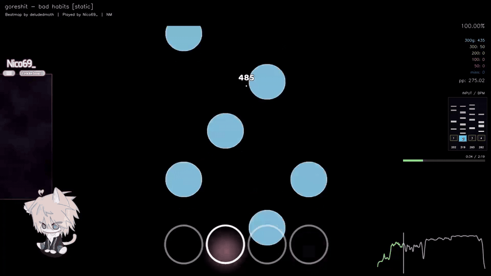

<div align="center">

# osu!mania Fast Renderer

**GPU-first replay rendering for osu!mania `.osr` files.**


[Download latest release](../../releases/latest) · [Usage](#usage) · [Skin support](#skin-support) · [Support](#support)



</div>

Created by [Nico69_](https://osu.ppy.sh/users/18298478) , this tool turns local osu!mania replays into skinned MP4 videos. It reads the replay, finds the matching beatmap, loads mania skin elements, renders gameplay with overlays, and muxes the map audio.

This is a public alpha. It is already usable for real renders, and skin compatibility will keep improving as more skins and replay edge cases are tested.

## Features

- Fast OpenGL-based frame generation.
- Hardware video encoding when available:
  - Linux: VAAPI.
  - Windows: AMF, NVENC, or QSV when FFmpeg exposes them.
- 4K and 7K osu!mania rendering.
- Dynamic legacy `skin.ini` parsing for:
  - receptors;
  - notes and long notes;
  - stage assets;
  - hit lighting;
  - judgement images;
  - combo/score fonts;
  - animated skin elements.
- Bundled verified skins:
  - ★ Nico69_ v4 — Verified [4k]
  - ★ Cawolo skin new Max — Verified [7k]
- Supported mods:
  - NoMod
  - Mirror
  - ScoreV2
  - DoubleTime / Nightcore
  - Nightcore pitch change
- DT/NC audio speed-up during render.
- Automatic osu! folder detection on Windows, Linux, Wine, osu-wine, and Lutris setups.
- Fast replay cache and beatmap lookup from replay hashes.
- Optional side statistics, key/BPM overlay, strain graph, timeline, results screen, and vignette.
- Startup update checks.

## Usage

1. Open the app.
2. Select your osu! folder if it is not detected automatically.
3. Select an `.osr` replay.
4. Let the app find the beatmap, or select the `.osu` file manually.
5. Pick a skin. Verified bundled skins are shown first.
6. Choose where to save the `.mp4`.
7. Render.

Each render creates a `.debug.json` next to the video. It includes missing skin elements, encoder information, replay matching details, and other diagnostics.

## Skin support

The renderer targets legacy osu!mania skins and reads the `[Mania]` sections from `skin.ini`.

Currently handled:

- `Keys`, `ColumnStart`, `HitPosition`, column widths, spacing, line widths, and lane colours;
- `KeyImage#`, `KeyImage#D`, `NoteImage#`, `NoteImage#H`, `NoteImage#L`, `NoteImage#T`;
- long-note body, cap, tail, release, and very short LN edge cases;
- animated elements using numbered skin frames;
- `Hit0`, `Hit50`, `Hit100`, `Hit200`, `Hit300`, `Hit300g`;
- stage left/right/bottom, stage hints, stage lights, hit lighting, and judgement line;
- combo/score font digits and ranking assets.

The code has been tested with multiple 4K and 7K skins. Some compatibility and optimization work was done through AI-assisted testing and code iteration.

## Accuracy and combo

The renderer reconstructs osu!mania judgements from replay inputs, then reconciles final counters with the values stored inside the `.osr`.

Handled cases include:

- normal notes;
- long-note head/release logic;
- ScoreV1 and ScoreV2 combo differences;
- Mirror lane mapping;
- DT/NC timing and audio speed.

## Installation

Download the latest build from [Releases](../../releases/latest):

- Windows: `osu-mania-replay-renderer-*-Windows-x86_64.exe`
- Linux: `osu-mania-replay-renderer-*-Linux-x86_64.AppImage`

Linux:

```bash
chmod +x osu-mania-replay-renderer-*-Linux-x86_64.AppImage
./osu-mania-replay-renderer-*-Linux-x86_64.AppImage
```

## Known issue

- The Linux AppImage build is currently unreliable on some systems. It may fail to create an OpenGL GPU context and fall back to the classic CPU renderer instead of using the GPU. If you need GPU rendering on Linux right now, running from source is recommended until the AppImage packaging issue is fully fixed.

## Development

Requirements:

- Python 3.12+
- [`uv`](https://github.com/astral-sh/uv)
- FFmpeg for local development builds

Run locally:

```bash
uv sync
uv run mania-renderer
```

Quick checks:

```bash
uv run python -m py_compile src/osu_mania_replay_renderer/*.py
uv run python -m osu_mania_replay_renderer --multiprocessing-smoke-test
```

Renderer structure:

- `renderer.py` high-level render orchestration.
- `fast_gpu_renderer.py` OpenGL frame generation.
- `renderer_media.py` FFmpeg/audio/hardware encoder handling.
- `skin_loader.py` dynamic skin parsing.
- `scoring.py` replay judgement, combo, accuracy, and ScoreV2 logic.

More details are in [docs/renderer_architecture.md](docs/renderer_architecture.md).

## Releases

GitHub Actions builds:

- Windows `.exe`
- Linux AppImage

## Support

<div align="center">


</div>

If this renderer helps you make osu!mania videos, you can support development on [Ko-fi](https://ko-fi.com/nico69yaza).

This tool is made by one person after many hours of testing, debugging, and coding. A small donation really helps the project grow and helps me keep building it.
